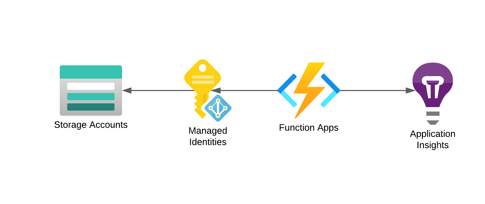

# Data Engineering Project with Bicep and Azure Functions

## Overview

This repository contains the Bicep code and associated files for a data engineering project focused on data ingestion and transformation using Azure App Functions and Polars. The goal of this project is to create an ETL flow that consolidates data from various sources.

